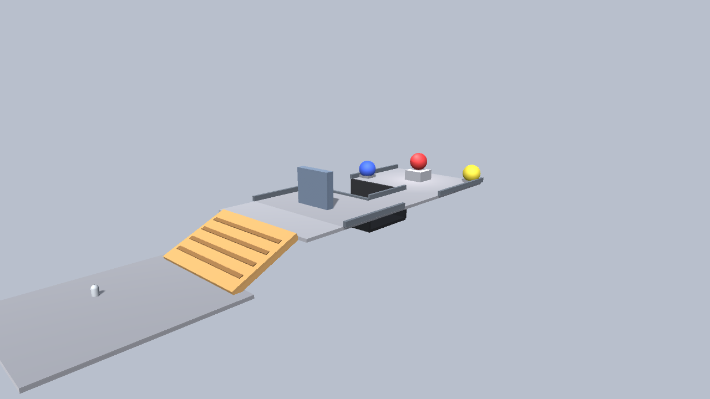
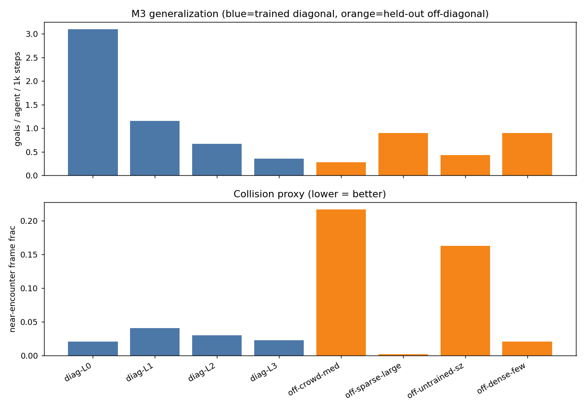
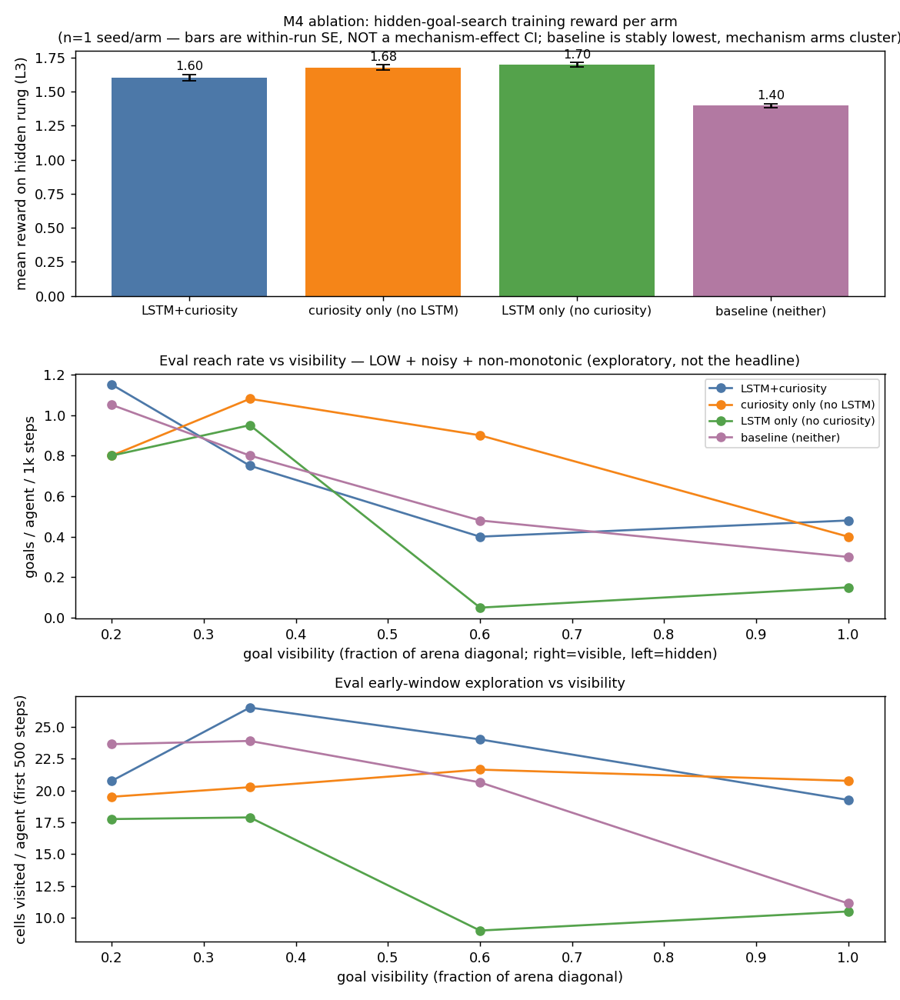
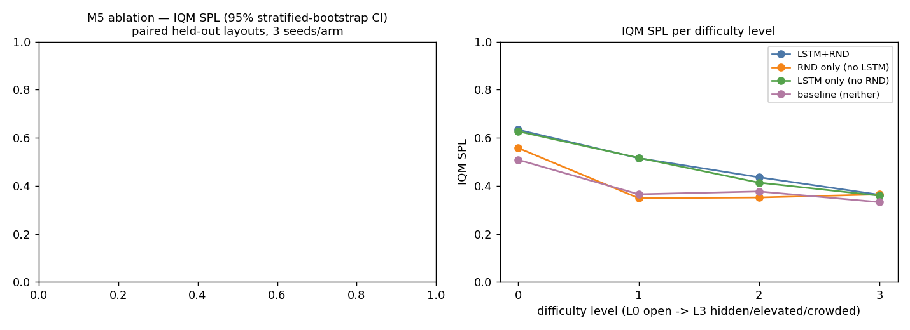
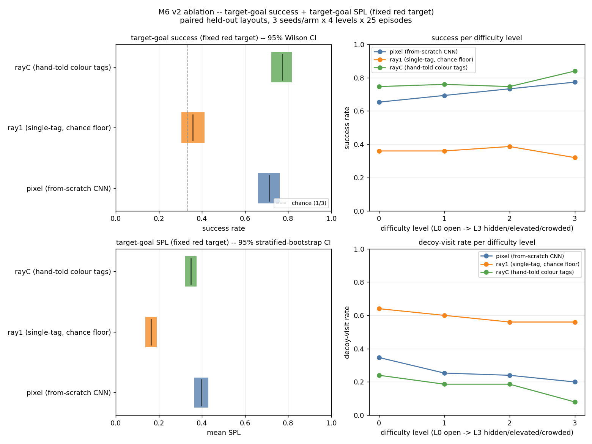
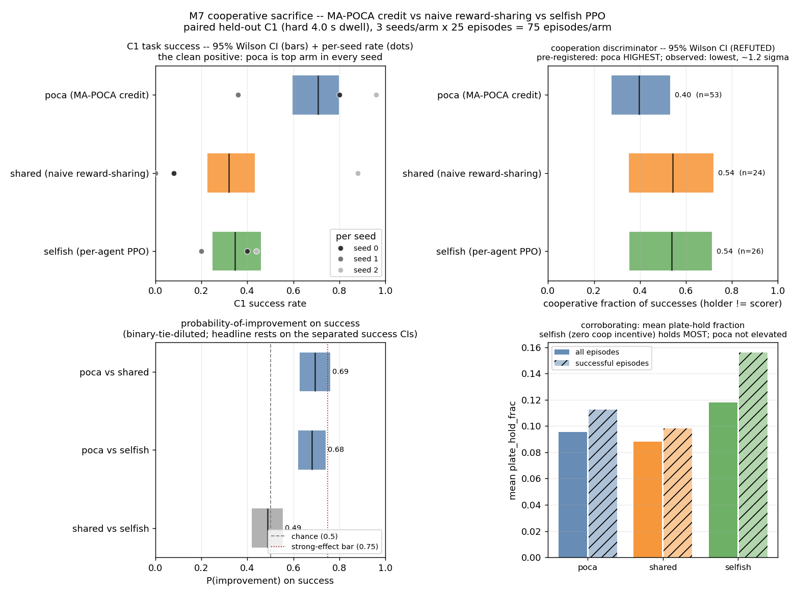

# NavSim - a reinforcement-learning navigation research simulator

NavSim is a Unity ML-Agents 3D navigation simulator, built as a sequence of reinforcement-learning research milestones.
Each milestone poses one question, answers it with a rigorous paired / multi-seed evaluation, and (mostly) ships a live in-browser WebGL demo.
The through-line is rigor and honesty: negative results are reported unforced, claims and decision rules are pre-registered before any compute is spent, statistics are multi-seed, and every headline is verified by driving the real system rather than by trusting a training curve.
The arc runs from a 2D foundation (M0-M4: crowds, curricula, hidden-goal search) into 3D (M5-M7: terrain search, visual object-goal search, cooperative credit assignment).

**Live demo:** https://navsim-webgl.vercel.app

*The capstone final stage: a legible critical path - tan tread ramp up to a raised ledge, a slate occluding wall, a risk/reward pit gap, and the red-target-among-decoys reveal - hand-authored to showcase the M6 visual object-goal search task on deliberately-composed terrain.*

## Pipeline

End-to-end and proven: a Unity scene -> ML-Agents PPO / MA-POCA training -> ONNX export -> Unity Inference Engine (Sentis) in-engine inference -> a WebGL build deployed on Vercel.

## The milestone arc

Each row is one question and its honest answer.

- **M0 - Pipeline smoke.**
  The full toolchain proven end to end: a single agent reaches a visible goal in-browser, through the entire Unity -> ML-Agents -> ONNX -> Sentis -> WebGL path.

- **M1 - Static obstacles.**
  Obstacle fields plus collision avoidance - the reactive-navigation baseline the later search work builds on.

- **M2 - Crowds + cooperative reward.**
  2-8 shared-policy agents with colour-coded goals, a cooperative congestion reward, and visual-only observations (no compass oracle); an interactive crowd-size slider in the demo.

- **M3 - Curriculum + generalization.**
  One collapsed difficulty axis co-varies agent count x arena size x obstacle density; the trained policy then *generalizes* to unseen off-diagonal layouts (off-diagonal goal rates stay within the trained range and body-overlap stays ~0). Live.

- **M4 - Hidden-goal search.**
  Ray length fades from visible to hidden and the distance-shaping reward is visibility-gated, so the agent must search. The policy learns hidden-goal search, but the LSTM x curiosity ablation is reported as honestly **inconclusive at n=1 seed** - the exact limitation that motivated M5's rebuilt methodology.

- **M5 - Memory x curiosity ablation.**
  LSTM x RND, 4 arms x 5 seeds x 3M steps, on a paired, pre-registered protocol (SPL, `rliable` IQM + bootstrap CIs + probability-of-improvement).
  LSTM is a **modest real gain** (IQM SPL 0.49 vs 0.40; PoI 0.57, below the pre-registered 0.75 "strong effect" bar); RND is a **clean null**.
  The honest headline: memory helps modestly, curiosity does nothing here.
  [`docs/M5-ablation-results.md`](docs/M5-ablation-results.md).

- **M6 - Visual object-goal search.**
  A from-scratch `nature_cnn` over 84x84 egocentric RGB pixels vs ray sensors, on a fixed-target colour-discrimination task - "pixels learn what rays must be told."
  The pixel CNN scores **0.71** vs `ray1`'s **0.36** (chance = 1/3, confirming no confound) and matches the hand-told upper bound `rayC` at **0.77**.
  The first, cued-colour design **failed four probes** (cross-modal binding was unlearnable at a local budget) and was honestly **redesigned** to the fixed-target task. Live.
  [`docs/M6-results.md`](docs/M6-results.md).

- **M7 - Cooperative sacrifice benchmark.**
  MA-POCA counterfactual credit assignment vs naive reward-sharing vs selfish PPO, on a plate-and-door task, 3 arms x 3 seeds.
  MA-POCA **more than doubles** C1 task success (0.71 vs 0.32 / 0.35, fully separated CIs) - a clean credit-assignment **competence** win.
  But the pre-registered *cooperation* hypothesis is **refuted, unforced**: POCA is no more cooperative than the baselines (C1 is solo-solvable, so competence and the cooperation proxy anti-correlate), and the airtight forced-sacrifice C2 rung was unreachable at a local budget (characterized as a boundary).
  A genuine negative, reported without spin.
  [`docs/M7-results.md`](docs/M7-results.md).

- **Capstone - the final stage (shown above).**
  A curated, deliberately-composed challenge course with a single legible critical path - ramp -> raised ledge -> occluding wall -> risk/reward pit gap -> the red-target-among-decoys reveal - demonstrating the visual-search task on hand-authored terrain.
  Built by `NavSim/Assets/Scripts/Editor/CapstoneSceneSetup.cs` (`Assets/Scenes/Capstone.unity`).

## What makes it research, not a reel

- **Unforced negatives.**
  M4 is reported inconclusive, M5's RND is a null, and M7's pre-registered cooperation hypothesis is refuted - each stated plainly, with no reshaping of the metric to rescue a headline.

- **Pre-registration.**
  The claim under test and the decision rule (e.g. PoI >= 0.75 to justify a lever, add seeds on an ambiguous result) are fixed *before* any compute is spent, so the methodology can prevent an overclaim instead of manufacturing one.

- **Multi-seed, reliable statistics.**
  Effects are aggregated with `rliable`: interquartile-mean (IQM), 95% stratified-bootstrap confidence intervals, and probability-of-improvement - not single-run point estimates.

- **Verification by driving the real flow.**
  Conclusions are checked by exercising the real system - in-Editor rollout watches of a checkpoint, byte-verified paired evaluation on identical held-out layouts - rather than by trusting an aggregate training curve (which, on this project, once hid a wandering policy behind a rising reward).

## Future work

- **M8 (CI/CD)** - automated `game-ci` build and deploy - is intentionally scoped out of this wrap.
- Turning the capstone into a fully playable, *trained* level (a live policy running the hand-authored course end to end).

## Tech stack

Unity 6 LTS, com.unity.ml-agents 4.0.x, Python 3.10.x, Unity Inference Engine (Sentis) 2.x, WebGL, Vercel.
See `VERSIONS.md` for exact pins.

---

# Milestone detail

## M3 - Generalization

M3 trains one shared PPO policy along a single **collapsed difficulty curriculum**: a lone `difficulty`
parameter co-varies agent count (2->8), arena size (half 6->11), and obstacle count (0->8) *together*, so
the curriculum advances along one monotonic diagonal through the (agents x arena x obstacles) cube. Ray
length is pinned to the largest arena's diagonal so goals stay visible at every lesson (keeping M3 in the
visible-goal regime, not hidden-goal search - that is M4). Training climbed all four lessons and broke
through on the hardest 8-agent config around 3M of 5M steps.

The milestone's exit criterion is **generalization**: the policy is evaluated on **held-out off-diagonal**
configurations it never trained as a tuple - e.g. 8 agents crammed into a small arena, 2 agents alone in
the huge arena, an untrained arena size, 2 agents in a dense obstacle field. The harness
(`M3GeneralizationEval`, run in-engine over the trained Sentis policy) sweeps both the trained diagonal and
the off-diagonal grid, reporting goals reached per agent and a collision proxy.

**Result:** off-diagonal goal rates stay within the trained-diagonal range (no collapse toward zero) and
body-overlap stays ~0 across every held-out config - the policy transfers to unseen layouts and densities.
Near-encounter frequency rises at the densest off-diagonal configs (8 agents in the smallest arena), which
is a *density* artifact - agents pass closer more often - not a breakdown in avoidance: overlap stays at or
below ~0.4% and closest approach stays near body width. Absolute goal rates carry sampling noise (the
compass-free ray-search behavior yields a low goal rate, so per-config counts are modest); the robust
signal is the off-vs-on-diagonal comparison, which holds. Regenerate the chart with
`training/eval/plot_generalization.py` over the harness CSV.

## M4 - Pure Search (Hidden Goals + LSTM + Curiosity)

M4 crosses M3's explicit boundary. M3 pinned the ray length to the max arena diagonal so the goal was
visible everywhere; M4 unpins it and **fades it along the curriculum** (1.0x -> 0.6x -> 0.35x -> 0.2x of the
diagonal), so on the top rung the goal is visible only within a short radius and the agent must **search**.
The privileged distance-shaping reward is **visibility-gated** - it guides the agent only while a ray could
reach the goal; while the goal is hidden, an **LSTM** (memory) and an **ICM curiosity** intrinsic reward are
the only drives. Room geometry (walls, obstacles, peers) stays ray-visible, so the observation contract is
unchanged from M3. Training uses a deterministic **progress-based** curriculum (visible warmup for the first
15% of steps, then two intermediate rungs, then ~2.75M steps on the hidden rung) - reward-thresholded
lessons proved unusable because the per-episode reward is too noisy to gate on (a probe finding).

**The policy learns hidden-goal search.** On the hidden rung the primary (LSTM + curiosity) climbs from a
cold-start reward of ~-2.7 (reaching almost no goals) to ~+1.6 (reaching goals faster than the step penalty
bleeds), and in the in-engine eval it reaches goals at every visibility and keeps body-overlap at exactly 0.

The exit criterion is an **ablation**: the same env + curriculum trained four ways (LSTM + curiosity /
LSTM-only / curiosity-only / neither) and compared on the hidden rung.

**Result (reported honestly).** The ablation is **inconclusive**. Within these runs the plain-PPO baseline
(no LSTM, no curiosity) is stably the weakest on the hidden rung (~1.40 vs ~1.60-1.70 for the three arms
that have at least one mechanism), but the three mechanism arms are **clustered within noise** and the
primary is not the best of them - so there is no clean "LSTM and curiosity are each necessary" story. Two
honest limits: (1) **n = 1 training seed per arm**, so no difference - including the baseline gap - can be
attributed to the mechanism rather than seed/initialization variance; (2) the eval's absolute reach rate is
low and *non-monotonic* in visibility (a compass-free-search + observation-clutter artifact), so it is shown
as exploratory, not as the headline. The most likely reading is that at 0.2x ray in a 22x22 arena the
"hidden" regime is still **solvable by reactive local search** - the agent bumps around ray-visible
structure and stumbles onto goals often enough that memory and curiosity are not *forced* to matter. A
sharper test would shorten the ray further, enlarge the arena, or occlude the goal behind obstacles, and run
multiple seeds. This limitation is exactly what M5 was rebuilt to fix. Regenerate with
`Tools/NavSim/Run M4 Search Eval` (writes `m4_search.csv`) and
`training/eval/plot_m4_search.py` (reads that plus the per-arm `m4_l3_reward.csv`).

## M5 - 3D Terrain Search (LSTM x RND Ablation)

M5 moves off M4's flat 2D arena into procedurally generated 3D terrain: a single `CharacterController`
learner (gravity + jump) navigates walls, ramp-reachable elevated platforms, hazard pits, and oblivious
mover-occluders to a line-of-sight-gated goal, perceived through three ray-fans (forward/down/up). A
`difficulty` curriculum ramps L0 (open, flat, goal visible) -> L3 (hidden, elevated, crowded).

The exit criterion is a 2x2 ablation over two levers (LSTM memory x RND curiosity), scored by a **paired**
protocol - every arm and seed evaluated on the *same* held-out layouts, on SPL (Success weighted by
inverse-optimal Path Length), aggregated with `rliable` (IQM + 95% stratified-bootstrap CIs +
probability-of-improvement), against a decision rule pre-registered before any run.

**Result.** Curiosity (RND) is a **clean null** (PoI 0.51, straddling 0.5) - it does nothing for SPL and
actively impedes the initial learning bootstrap. Memory (LSTM) helps, **modestly** (IQM SPL 0.49 vs 0.40;
PoI 0.57, below the pre-registered 0.75 "strong effect" bar), with the benefit concentrated on the easier,
flatter levels and vanishing at the hardest, most-occluded one. Full write-up, methodology, and honest
caveats: [`docs/M5-ablation-results.md`](docs/M5-ablation-results.md).

## M6 - Visual Object-Goal Search (Fixed-Target Colour Discrimination)

M6 makes **perception itself** the ablated lever on top of M5's terrain spine. Three geometrically
identical goals spawn per episode; the target is a **fixed colour** (red), the two decoys are random
distinct non-target colours. Three arms differ only in what they can see (LSTM on, no RND, identical
reward/curriculum in all three): `pixel` (an 84x84 egocentric RGB camera into a from-scratch CNN), `ray1`
(ray fans, one undifferentiated goal tag - a provable chance floor), and `rayC` (ray fans, hand-told
per-colour tags - the upper bound). Evaluation is the same paired, always-hard, `rliable`-aggregated
protocol as M5, gated by a five-point decision rule pre-registered before the full 9-run ablation.

**Result.** The from-scratch CNN **matches the hand-told upper bound and clearly beats the colour-blind ray
sensor.** `pixel` success 0.713 (95% CI 0.660-0.762) is fully separated from `ray1`'s 0.357 (CI 0.305-0.412,
containing chance = 1/3 exactly, confirming no confound) with PoI(SPL) = 1.000. `pixel` vs `rayC` (0.773,
CI 0.723-0.817) overlap on success - a statistical match - with `pixel` nominally ahead on path efficiency
(mean SPL 0.398 vs 0.348). Getting here required diagnosing and discarding a failed first design (a
per-episode colour *cue* that a from-scratch CNN could not learn to bind to pixels across four training
attempts) - the honest negative result that led to this fixed-target redesign. Full write-up, the cued-negative
evidence, and honest caveats: [`docs/M6-results.md`](docs/M6-results.md).

## M7 - Cooperative Sacrifice (MA-POCA Credit Assignment)

M7 makes **reward routing** the ablated lever. Two shared-policy agents share a plate-and-door arena: a
door opens only while an agent stands on a pressure plate, and the goal sits past the door. Three arms
differ only in how the sparse reward is routed (identical network, observations, and curriculum): `poca`
(MA-POCA counterfactual credit assignment), `shared` (naive reward-sharing PPO), and `selfish` (per-agent
PPO). Evaluation is the same paired, byte-verified, `rliable`-aggregated protocol as M5/M6, at a hard C1
rung (4.0 s door-open grace), 3 seeds x 25 episodes per arm.

We **pre-registered** the hypothesis that credit assignment would produce the highest *cooperative
fraction* (one agent holding the plate while the other crosses - learned sacrifice).

**Result (reported honestly).** The competence result is a **clean positive**: MA-POCA **more than doubles**
C1 success versus both baselines (`poca` 0.707, 95% CI 0.596-0.798, vs `shared` 0.320 and `selfish` 0.347 -
fully separated CIs, and `poca` is the top arm in every seed). But the pre-registered cooperation hypothesis
is **refuted, unforced**: `poca` shows the *lowest* cooperative fraction (0.396 vs 0.542 / 0.538), and the
difference is within noise (~1.2 sigma). The mechanism is that C1 is **solo-solvable** - one agent can tap
the plate and sprint across alone - so cooperation is a crutch of the weaker policies, and the strongest
policy (poca) solves it solo and faster; competence and the cooperation proxy anti-correlate at a
solo-solvable rung. The only rung where sacrifice was geometrically **forced** (C2, plate off the
goal-approach path) proved **not learnable** at a local budget (0/100, zero plate contact, with and without
a curriculum bridge), against a scene a self-test confirms *can* score a forced sacrifice. The negative is a
feature, not a failure - same discipline as M5's RND null and M6's cued-binding negative. Full write-up, the
mechanism, the C2 boundary, the multi-probe methodology arc, and honest limitations:
[`docs/M7-results.md`](docs/M7-results.md).

## Layout

- `NavSim/` - the Unity project (created in M0 Task 1).
- `NavSim/Assets/Scenes/Capstone.unity` - the curated capstone showcase stage; `CapstoneSceneSetup.cs` (under `Assets/Scripts/Editor/`) rebuilds it.
- `docs/capstone/` - the hero render (`capstone.png`) and its earlier iterations.
- `docs/` - the per-milestone results write-ups (`M5-ablation-results.md`, `M6-results.md`, `M7-results.md`).
- `training/` - Python ML-Agents trainer configs, environment, and the evaluation harness + figures.
- `web/` - the WebGL build output deployed to Vercel.
- `docs/superpowers/` - design spec and milestone plans (local only, not pushed).
